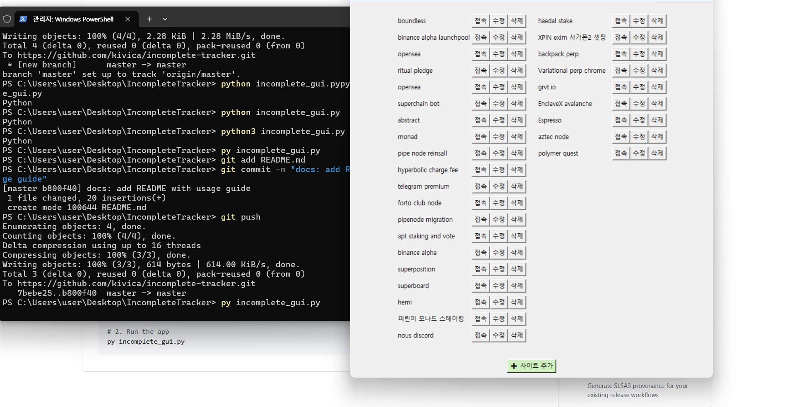

# Incomplete Tracker

✅ A simple GUI tool to manage and track pending testnet-related tasks visually.

## 🧰 Features

- Easily add, edit, delete testnet sites
- JSON-based persistent storage
- Simple and intuitive GUI with Tkinter

## 🖥️ How to Run

Python 3.7+ is required.

```bash
# 1. Move into the project folder
cd IncompleteTracker

# 2. Run the app
py incomplete_gui.py
## 🖥️ Screenshot

Here's how the Incomplete Tracker GUI looks while running:




